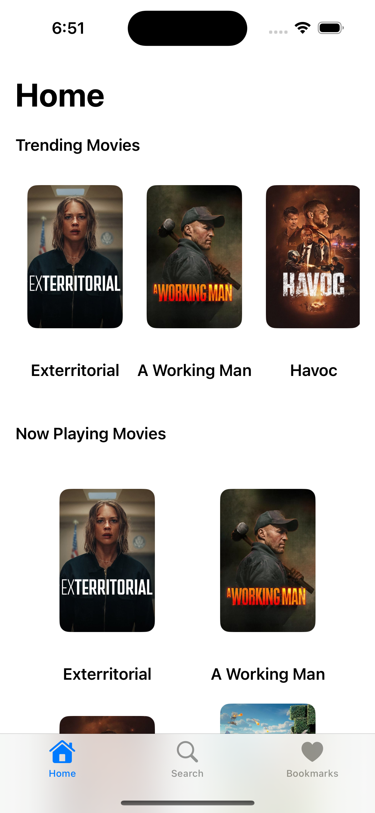
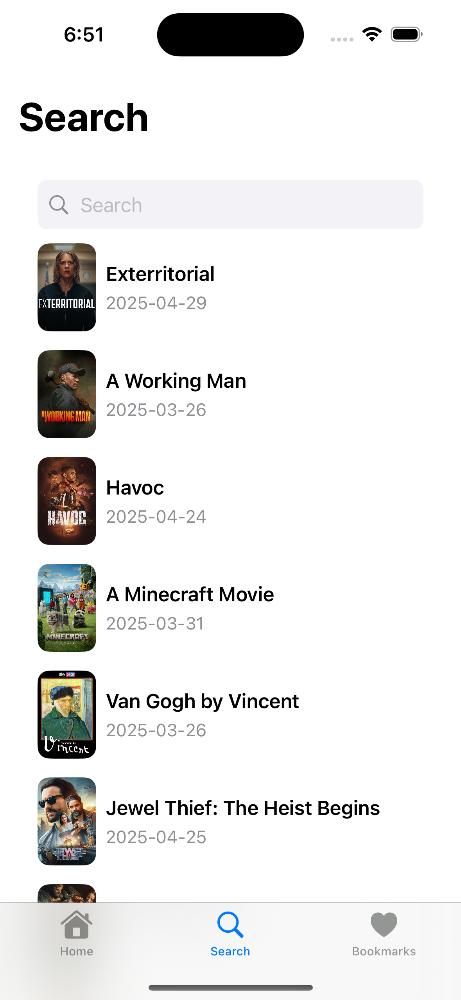
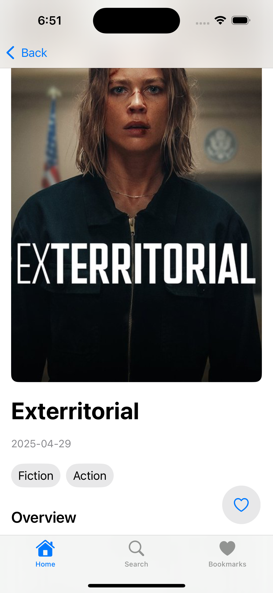
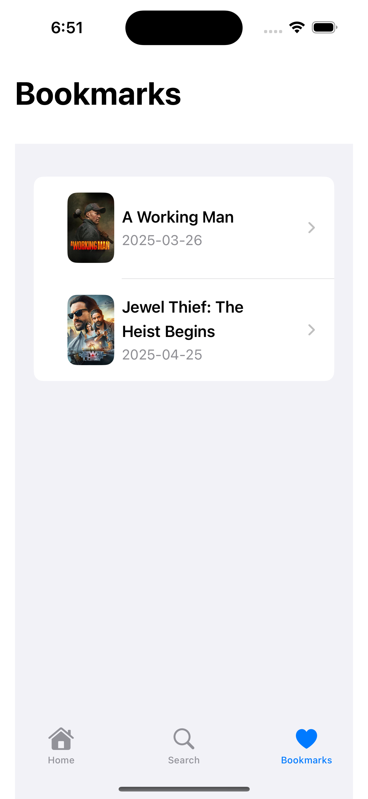

# Movify

Movify is an iOS application that allows users to explore trending and now-playing movies, search for movies, and bookmark their favorite ones for easy access. The app is built using Swift and follows the MVVM architecture pattern for clean and scalable code.

## Features

- **Home Screen**: Displays trending and now-playing movies in a visually appealing layout.
- **Search**: Allows users to search for movies by title.
- **Movie Details**: Provides detailed information about a selected movie, including its title, release date, genres, and overview.
- **Bookmarks**: Enables users to bookmark their favorite movies and view them in a dedicated bookmarks section.
- **Offline Support**: Bookmarked movies are stored locally using Core Data for offline access.
- **Responsive Design**: Optimized for various iPhone screen sizes, ensuring a seamless user experience.

## Installation

1. Open the project in Xcode:
    ```bash
    cd movify
    open Movify.xcodeproj
    ```
2. Build and run the app on a simulator or a physical device.

## MovifyMock Target

If you experience any network issues or the TMDb API is not working, you can use the **MovifyMock** target. This target runs the app with mock data, allowing you to explore all features without relying on live API responses.

To use MovifyMock:
1. In Xcode, select the **MovifyMock** scheme from the scheme selector at the top of the window.
2. Build and run the app as usual.

## Technologies Used

- **Swift**: The programming language used to build the app.
- **MVVM Architecture**: Ensures clean separation of concerns and scalability.
- **Core Data**: Used for local data storage to support offline access.
- **The Movie Database (TMDb) API**: Provides movie data such as trending movies, now-playing movies, and search functionality.

## Screenshots

### Home Screen
The home screen displays trending and now-playing movies in a horizontal scrollable layout.



### Search Screen
The search screen allows users to search for movies by title and displays the results in a list.



### Movie Details Screen
The movie details screen provides detailed information about a selected movie, including its title, release date, genres, and overview. Users can bookmark the movie using the heart icon.



### Bookmarks Screen
The bookmarks screen displays a list of movies that the user has bookmarked.



## License

This project is licensed under the MIT License. See the [LICENSE](LICENSE) file for details.